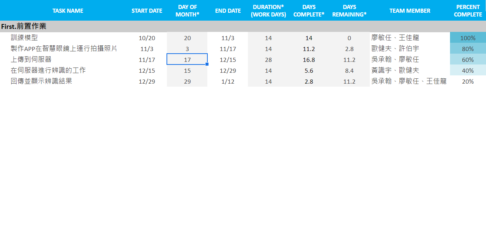
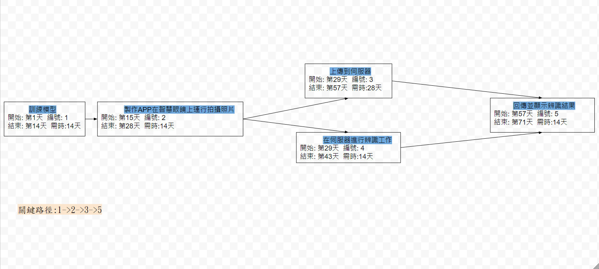

# 2020_OO_Group_three

## 姓名:廖敏任 班級:資管三甲 學號:C107118134
### 小組成員:吳承翰(組長,後端) 廖敏任(前端)
### 題目:智慧眼鏡應用
### 摘要:我們要應用智慧眼鏡

#### 甘特圖

#### CPM

### 功能性需求 :
##### 顯示辨識的結果

### 非功能性需求： 
##### 反應時間：使用者拍攝照片後上傳到伺服器，伺服器進行辨識後回傳到眼鏡的時間。
##### 可靠度：網路不穩、拍攝照片對比度不高皆可能影響辨識結果。
##### 效能：照片的辨識只能一次辨識一張。

### 功能分解圖

### 需求分析的文字描述
##### 1.使用者藉由此軟體對目標的臉部進行辨識
##### 2.管理者可以後台載入以新增、變更、刪除人臉資
##### 3.管理者可藉由後台來管理使用者權限
##### 4.管理者可以透過後台來調整辨識精準度

### 使用案例說明

